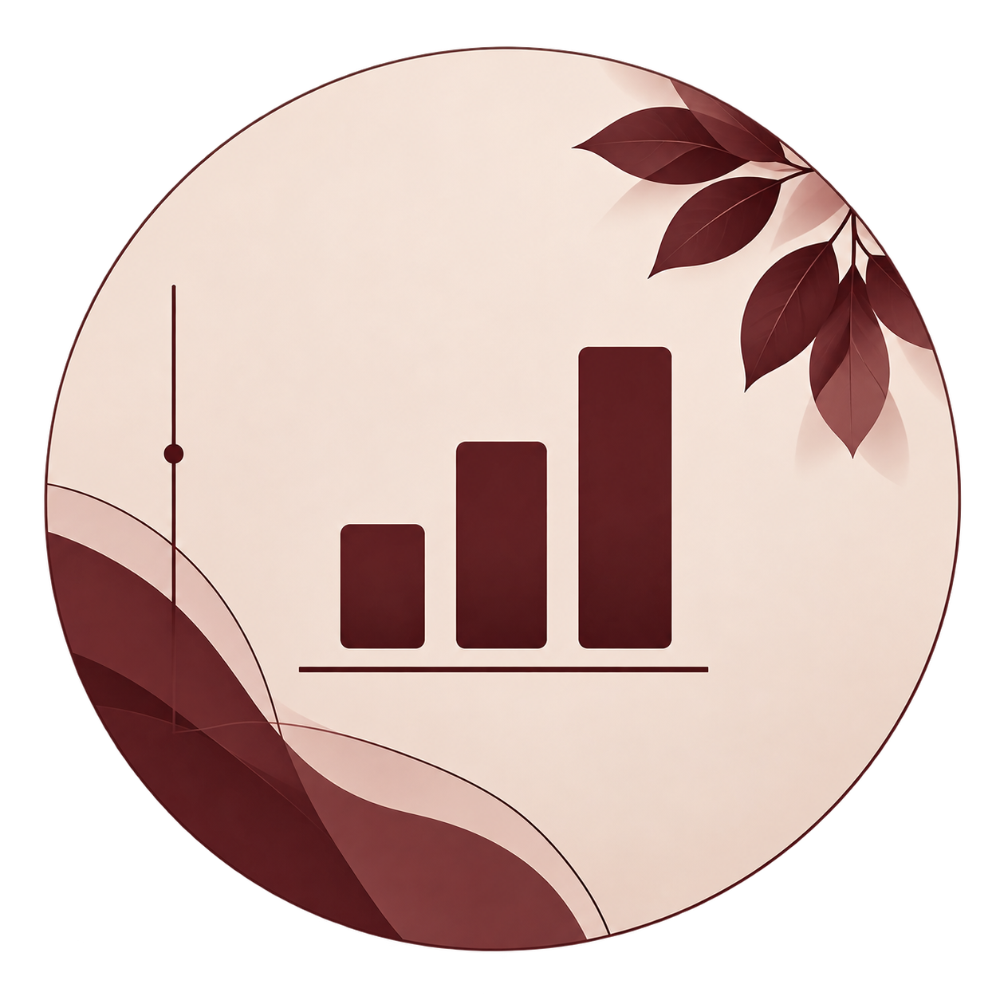

# Hi, I'm Nadya 👋🏾

I'm a recent Computer Science and Statistics graduate who enjoys working at the intersection of **data, technology, and people**.

I like exploring interesting questions through data, building things that are useful or interactive, and learning new tools along the way.

 

<table>
<tr>
<td width="33%" valign="middle">

&nbsp;&nbsp;
<strong>Explore</strong> 
&nbsp;&nbsp;
Curious about data, research, and the stories behind them.
</td>

<td width="33%" valign="middle">

&nbsp;&nbsp;
<strong>Build</strong> 
&nbsp;&nbsp;
Create interactive and useful tools and visualizations.
</td>

<td width="33%" valign="middle">

&nbsp;&nbsp;
<strong>Connect</strong> 
&nbsp;&nbsp;
Always excited to learn from and work with others.
</td>
</tr>
</table>

 

<h2>Find me around the web 🌎</h2>

&nbsp;

